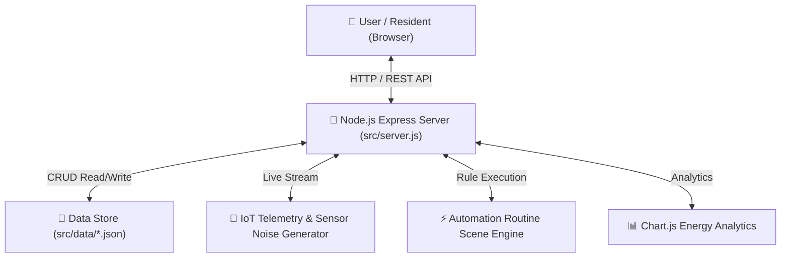

# HomePulse – Smart Home Automation System 🏠⚡

[](https://ruet.ac.bd)
[](https://nodejs.org)
[](https://expressjs.com)
[](LICENSE)

> **Course:** CSE 3206 – Software Engineering Sessional  
> **Lab Assignment:** Lab 2: Software Process Models, Requirement Analysis & MVP Development  
> **Group Assignment:** Group#02 from Section B (2nd 30)  
> **Assigned Scenario:** #32 – Smart Home Automation System  
> **Process Model Selected:** Prototype Model  

---

## 🌟 Overview

**HomePulse** is an intelligent, web-based Smart Home Automation and IoT Ecosystem developed for CSE 3206 Lab 2. It unifies control over smart lights, HVAC climate units, security locks, surveillance camera feeds, and appliances across multiple rooms into a single real-time glassmorphism dashboard.



---

## ✨ Key Features

1. **Centralized IoT Dashboard:** Glassmorphism UI displaying indoor temperature, humidity, active wattage load (kW), and connected device counts.
2. **Device Controls:** Dynamic toggles for Smart Lights (brightness adjustment), HVAC Thermostats (target temp adjustments), Smart Locks, and Security Cameras.
3. **Automated Routine Scenes:** One-click shortcuts for scenes:
   * **Away Mode:** Locks doors, shuts off lights, sets HVAC to 26°C eco-mode.
   * **Night Mode:** Dims lights to 15%, locks entrance doors, sets bedroom temp to 22°C.
   * **Movie Time:** Dims main lights, turns on ambient cyan strip lighting.
   * **Energy Saver:** Turns off non-essential devices when power consumption spikes.
4. **Real-Time IoT Telemetry Simulator:** Asynchronous background feed generating realistic sensor noise for temperature and power consumption.
5. **Interactive Energy Analytics:** Live Chart.js line charts representing hourly kWh usage trends and room power distribution.
6. **Role-Based Access Control:** Dynamic switcher between **Admin** (full access), **Resident** (control only), and **Guest** (restricted view-only).
7. **System Audit Trail:** Real-time event drawer recording every device state change, security alert, and routine trigger.

---

## 🚀 Quick Start Guide

### Prerequisites
- [Node.js](https://nodejs.org) (v18 or higher installed)

### Installation & Execution

1. **Clone the repository:**
   ```bash
   git clone https://github.com/ruet-cse-3206/homepulse-smart-home.git
   cd homepulse-smart-home
   ```

2. **Start the Web Application:**
   ```bash
   npm start
   ```

3. **Open in Browser:**
   Navigate to `http://localhost:3000` to view the live HomePulse Dashboard.

4. **Run Automated Test Suite:**
   ```bash
   npm test
   ```

---

## 📁 Repository Structure

```
├── README.md                           # Main documentation & setup guide
├── package.json                        # Node.js dependencies & scripts
├── docs/
│   ├── Requirement_Report.md           # Full 16-section Design Report
│   └── Requirement_Report.pdf          # Report printable output format
├── assets/
│   └── screenshots/                    # UI Dashboard Screenshots
└── src/
    ├── server.js                       # Express REST API, Custom Routine Engine & Budget API
    ├── data/                           # JSON Persistence layer
    │   ├── devices.json                # Device definitions & states
    │   ├── routines.json               # Automation rules
    │   ├── budget.json                 # Monthly energy budget & tariff data
    │   ├── diagnostics.json            # Device health, battery & firmware status
    │   ├── users.json                  # User roles & credentials
    │   └── logs.json                   # System audit logs
    ├── public/                         # Frontend Single Page App
    │   ├── index.html                  # Dashboard HTML structure
    │   ├── css/style.css               # Dark glassmorphism stylesheet
    │   └── js/                         # Client side modules
    │       ├── app.js                  # SPA logic & CRUD event handlers
    │       ├── charts.js               # Chart.js analytics engine
    │       └── telemetry.js            # Live IoT polling manager
    └── tests/
        └── api.test.js                 # API automated unit tests
```

---

## 🌿 GitHub Collaboration & Feature Branching Model

The repository history tracks feature additions executed across distinct developer feature branches:

| Branch Name | Primary Scope & Feature Added | PR Link / Status |
|---|---|---|
| `main` | Production Stable Release | Base Branch |
| `feature/solar-weather-widget` | Added Live Outdoor Weather & Solar Power Generation Card | Merged -> `main` |
| `feature/device-search-filter` | Added Real-Time Device Search Bar & Active/Inactive Status Filters | Merged -> `main` |
| `feature/rgb-color-palette` | Added Interactive RGB Smart Lighting Color Swatch Palette | Merged -> `main` |
| `feature/cctv-surveillance-monitor` | Added CCTV Surveillance Monitor (Cam 1/2/3 switching & motion alert) | Merged -> `main` |
| `feature/2d-floorplan-heatmap` | Added Interactive 2D Smart House Floorplan Heatmap view | Merged -> `main` |
| `feature/custom-rule-builder-and-energy-budgeting` | Added Custom Automation Rule Creator Engine & Energy Budget Tariff Estimator | Merged -> `main` |
| `feature/predictive-health-diagnostics` | Added Device Health Diagnostics, Low Battery Alerts & OTA Firmware Updates | Merged -> `main` |
| `feature/emergency-safety-lockdown` | **FLAGSHIP FEATURE 1:** Added Emergency Safety Lockdown & Hazard Alarm System (Fire Evacuation Protocol & Intruder Lockdown) | Merged -> `main` |
| `feature/ai-natural-language-assistant` | **FLAGSHIP FEATURE 2:** Added AI Natural Language Command Assistant & NLP Intent Engine v2.0 | Merged -> `main` |


---

## 📄 License & Attribution

Developed for **Rajshahi University of Engineering & Technology (RUET)**, Department of Computer Science & Engineering — Course CSE 3206.

